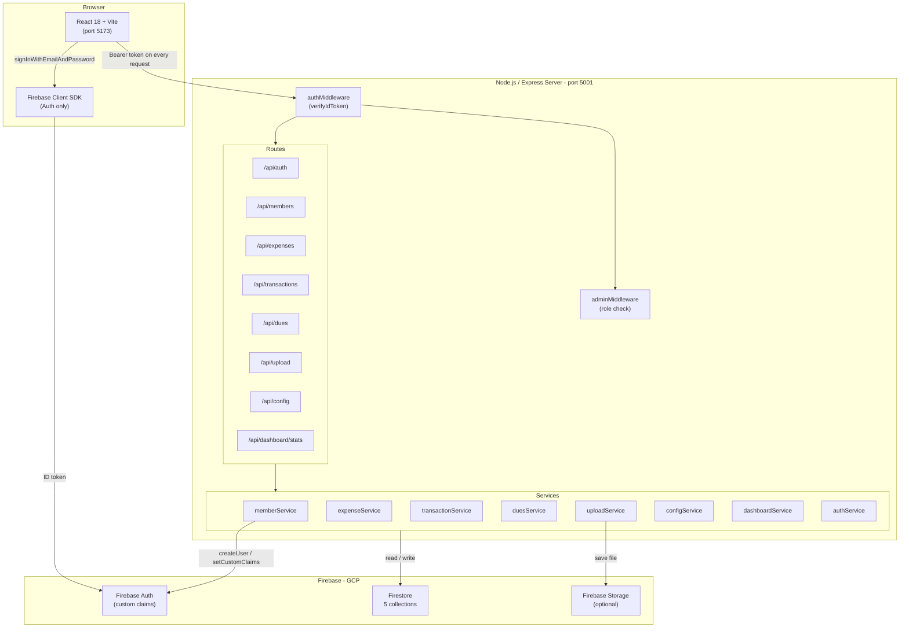
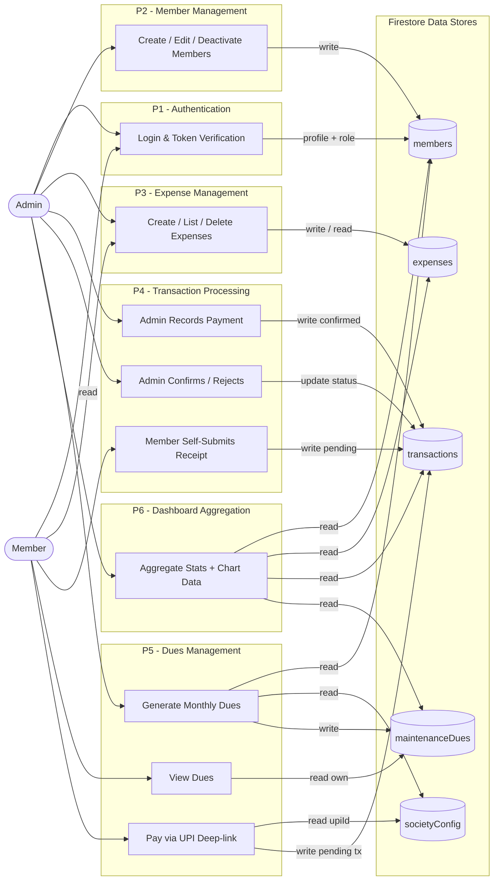
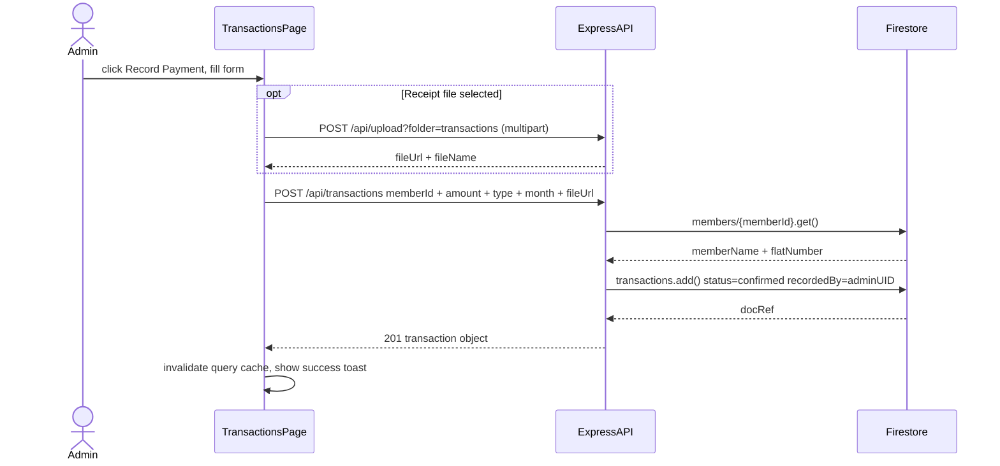
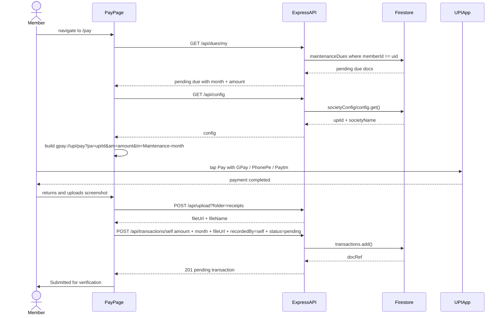
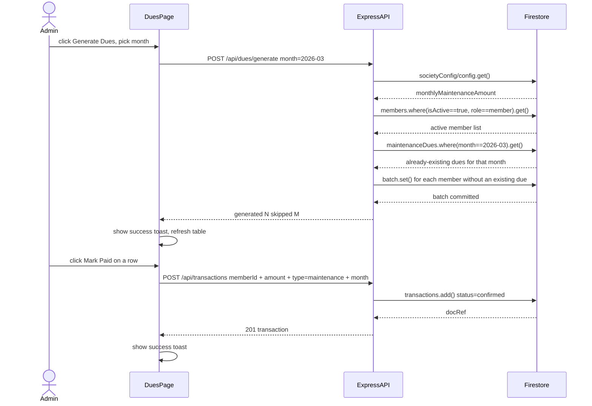

# Society Management App — Architecture, DFD & Sequence Diagrams

---

## 1. System Architecture Diagram

Shows the three-tier layout: Browser (React + Firebase Client SDK), Express backend (middleware → routes → services), and Firebase/GCP (Auth, Firestore, Storage).

---

## 2. Data Flow Diagram (DFD) — Level 1

Shows all six process groups, the two external entities (Admin and Member), and the five Firestore data stores, with labelled data flows between them.

---

## 3. Sequence Diagrams

### 3a. Login Flow

Covers Firebase sign-in, ID token acquisition, custom claim propagation, and role-based redirect to admin vs member dashboard.

```mermaid
sequenceDiagram
    actor User
    participant LoginPage
    participant FirebaseAuth
    participant AuthContext
    participant ExpressAPI
    participant Firestore

    User->>LoginPage: enter email + password
    LoginPage->>FirebaseAuth: signInWithEmailAndPassword()
    FirebaseAuth-->>LoginPage: UserCredential
    LoginPage->>FirebaseAuth: getIdToken(forceRefresh=true)
    FirebaseAuth-->>LoginPage: JWT with role custom claim
    LoginPage->>AuthContext: login(email, password)
    AuthContext->>ExpressAPI: GET /api/auth/me (Bearer token)
    ExpressAPI->>FirebaseAuth: verifyIdToken(token)
    FirebaseAuth-->>ExpressAPI: decoded uid + role
    ExpressAPI->>Firestore: members/{uid}.get()
    Firestore-->>ExpressAPI: member profile doc
    ExpressAPI-->>AuthContext: profile JSON
    AuthContext-->>LoginPage: profile.role
    alt role == admin
        LoginPage->>User: redirect /admin/dashboard
    else role == member
        LoginPage->>User: redirect /dashboard
    end
```

---

### 3b. Admin Records a Payment

Covers optional receipt upload to Firebase Storage, transaction creation with denormalized member data, and query cache invalidation.

---

### 3c. Member Pays Maintenance (UPI Flow)

Covers due and config fetching, client-side UPI deep-link construction, external payment app redirect, receipt upload, and self-submitted pending transaction.

---

### 3d. Admin Generates Monthly Dues and Marks a Due as Paid

Covers idempotent batch generation (skipping existing dues), and the admin "Mark Paid" flow that creates a confirmed transaction.

